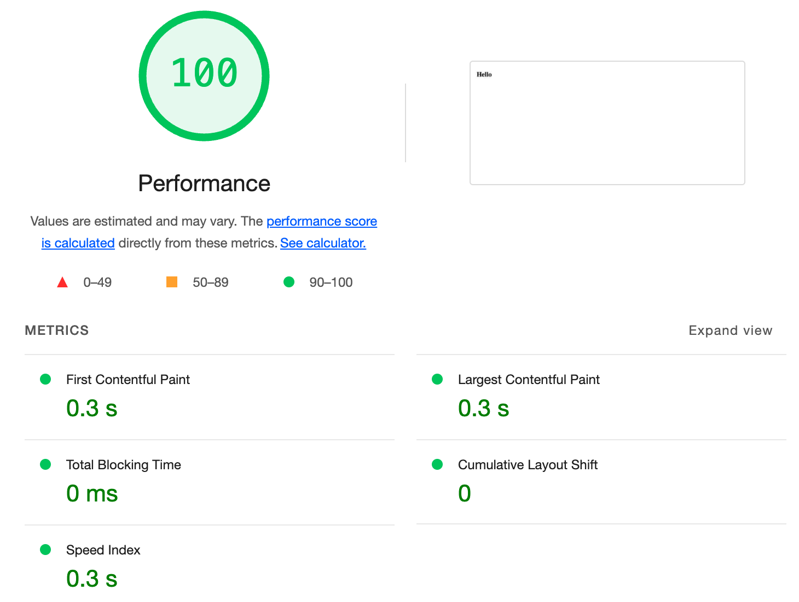
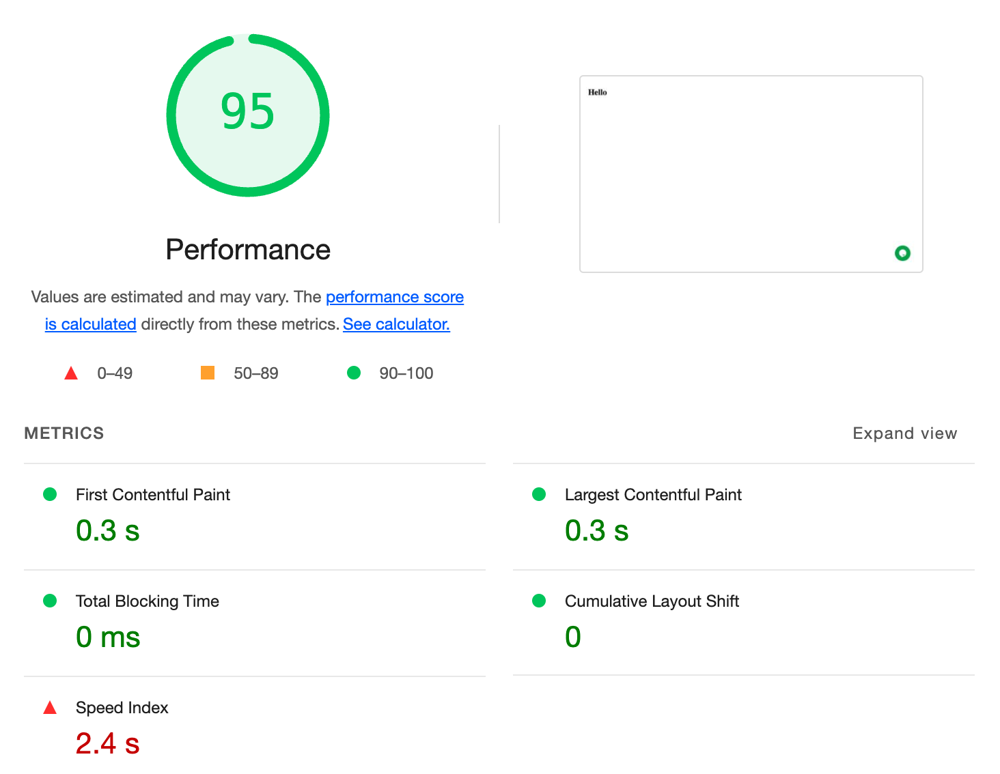
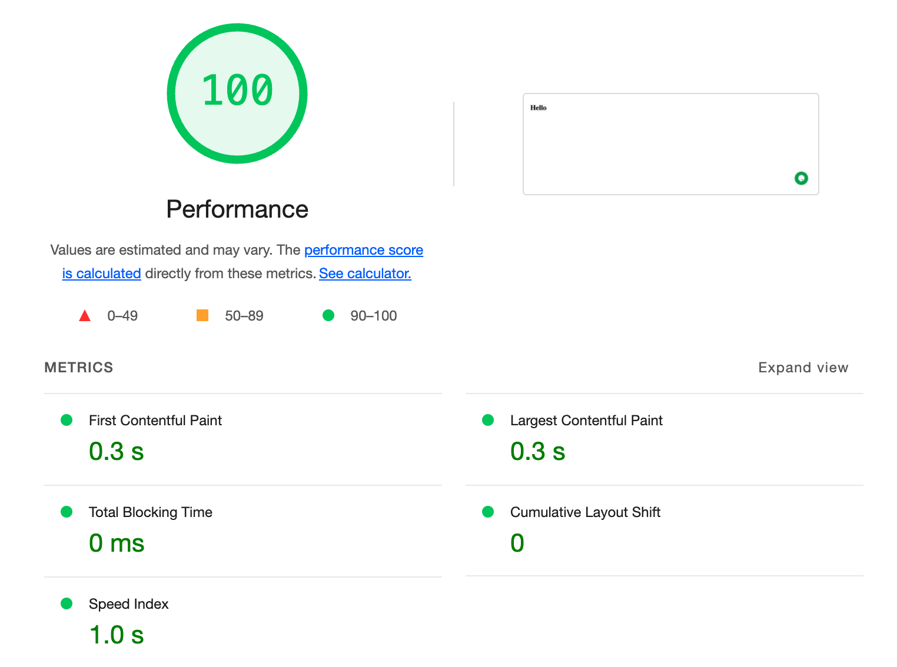

# Task 1 - 1. Loading Live Chat without affecting performance

For this exercise the aim for the client is to install the chat
application (tawk.to) which is loaded using installing the `<script>`
tag within the page without impacting the CVW of the website.

To approach this task I first created a ngrok tunnel to my local
workspace and hosted the `frontend` to a ngrok provided domain.

Once the website was up and running I removed the `<script>` tag
to simulate an original baseline for website loading speed
(see screenshot 1)

### Screenshot 1 (Performance without chat script)

### Screenshot 2 (Performance with chat script)

### Problem

As clearly visible in the second screenshot, the lighthouse performance
of the website did go down by 5 points, with a considerable impact
to the `Speed Index` denoted in red.

### Proposed Solution

The solution to this problem I would propose is fairly simple, 
`scripts` that you load within your html reduce your overall 
performance considerably. It just means the browser has to load 
all those resources and execute them before the user can interact
with your website.

We cannot avoid the issue, but what we can do is either use the
`async` or `defer` attributes on the script tag. This will load
the script parallel to the page load. The `defer` attribute is 
preferred as it will wait for the DOM to completely parse before
executing the script and thus reducing the impact on the score.

I added the `defer` attribute to the `<script>` tag, the lighthouse
score returned to 100 as it was before adding the script, thus 
resolving the issue.

### Screenshot 3 (Performance with chat script with defer attribute)

