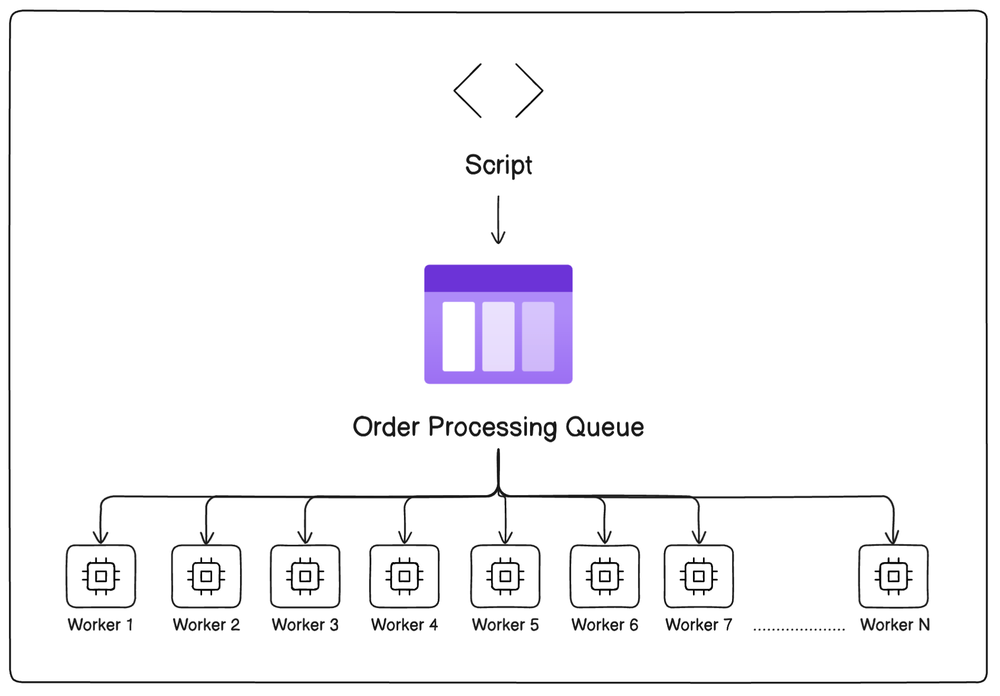

# SaaS Migration Solution

Migration of data albeit a complex task, can be solved by proper
planning and execution. Migration of `5 Million` orders into the
SaaS platform with each order taking 1 second to import would mean
a total effective time of approx 2 months to import all the data
when done in `series processing`.

As we have only 1 day (86400 seconds) to import the data, we need
to implement a solution that utilizes `parallel processing`.

The basic idea is we need to write a script that runs multiple calls
to the RESTFul api every second. As per the calculations we need to
run approx 60 parallel processes every second to consume 5 million
records.

```
$processes = (5000000/86400);   // 60 processes per second
```

This solution is based on the assumption that the RESTful API
would allow 60 requests per second, and we do not exceed its
```
x-ratelimit-limit (or whatever is its rate limit header)
```

I would implement a script that fetches orders and pushes into a
queue (RabbitMQ or some other queue broker). The queue would be
consumed by multiple queue workers that would process multiple
order insertions to the API per second.



The number of the queue workers would be adjusted based on the
workers required to process roughly 65-70 tasks per second, with
a `retry policy` to re-try failed attempts least 2 times.

Each successful import would be written to a log file, so would an
unsuccessful attempt. The log writing could be offloaded to another
group of workers that only handle logging tasks.

As with every system, there are bound to be un-expected errors when
importing the order record. As a contingency plan a backup script
would try importing the failed records.

If possible it the script/process would be tested using a smaller
dataset, to ensure the script import works as intended in the
constrained time frame for the smaller set.

The above solution would ensure reliable import of the order records
from `monolith` to `SaaS`  within the desired time frame of 1 day.